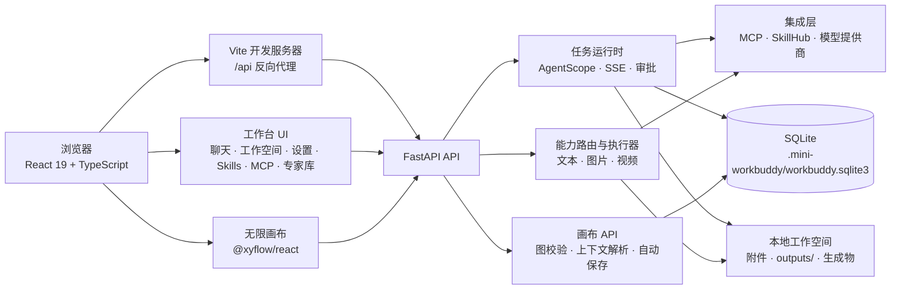
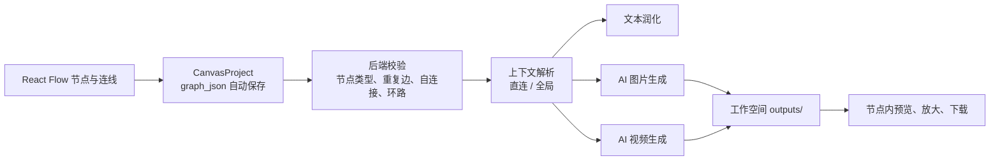

# mini-workbuddy

一个本地优先的 AI 工作台：在同一个界面内管理工作空间、对话任务、模型、Skills、MCP、专家团，以及用于组织 AIGC 图片/视频流程的无限画布。

项目面向单机、本地文件夹协作场景。数据默认保存在本机 SQLite 与用户选择的工作空间中；外部大模型、图片/视频模型和 MCP 服务均由用户自行配置。

## 核心能力

- 工作空间与任务：按本地目录组织任务、对话、附件和最终产物。
- Agent 对话：支持流式任务执行、审批、取消、事件重连、上下文压缩和长期记忆。
- 模型与能力路由：聊天主模型、图片理解、图片生成和视频生成可分别配置模型。
- Skills 与 MCP：管理应用级 Skill、安装 Skill 依赖、配置 stdio / SSE / Streamable HTTP MCP 服务。
- 专家库与专家团：单专家 Prompt 或多个只读分析 Worker 并行分析，再由主 Agent 汇总。
- 无限画布：基于 React Flow 的 AIGC 工作流编辑器，支持文本、图片上传、AI 图片、视频上传、AI 视频、备注六类节点。
- 媒体工作流：上传图片/视频、视频按秒抽帧预览、快捷从帧创建图片节点、AI 图片/视频产物预览与下载。

## 系统架构



### 无限画布执行链路



画布项目与专家库是两个独立一级入口：不共享专家选择状态、不修改专家数据，也不绑定专家业务逻辑。画布项目记录自己的归属工作空间，仅用于决定本地文件与生成物保存位置。

## 技术栈

| 层级 | 技术 | 用途 |
| --- | --- | --- |
| 前端 | React 19、TypeScript、Vite 6 | 单页工作台与开发构建 |
| 画布 | `@xyflow/react` | 节点拖拽、连线、缩放、MiniMap、网格与视口 |
| 样式 | 原生 CSS | 暖白工作台视觉、节点和媒体交互 |
| API | FastAPI、Pydantic、Uvicorn | REST API、请求校验、SSE 输出 |
| 持久化 | SQLite、Repository 封装 | 本机配置、任务、画布、记忆等持久化 |
| Agent | AgentScope | 真实 Agent、工具调用、上下文处理 |
| 扩展 | MCP、SkillHub / skills.sh | 外部工具服务与可复用 Skill |
| 文档 | python-docx、pypdf、openpyxl | Office / PDF / 文本资料解析 |
| 模型适配 | OpenAI 兼容 API、DashScope/百炼万相适配 | 对话、图片生成、图生视频 |

## 功能说明

### 工作空间、任务与文件

- 工作空间对应本机目录；任务、消息和应用配置存入本地 SQLite。
- 上传文件和生成产物保留在对应工作空间；AI 图片、AI 视频输出默认落在 `outputs/`。
- 文件相关接口会校验目标路径，拒绝越出当前工作空间的读写路径。
- 后台 Run 使用 SSE 回传进度。浏览器短暂断开不会自动停止 Run，客户端按事件序号继续读取。

### 模型与能力路由

在“设置 → 模型配置”中添加模型，填写模型 ID、Base URL、API Key 环境变量，并勾选对应能力。能力路由独立于聊天主模型：例如保持聊天使用一个模型，同时让图片和视频节点使用另外的模型。

| 能力 | 当前执行方式 | 结果 |
| --- | --- | --- |
| 对话 / 文本润化 | OpenAI 兼容 Chat Completions 或 AgentScope 运行时 | 对话消息或文本节点内容 |
| 图片生成 | OpenAI Images API 兼容接口 | 工作空间 `outputs/` 中的图片 |
| 通用视频生成 | 已配置视频模型的创建、状态轮询、下载适配 | 工作空间 `outputs/` 中的视频 |
| 万相 2.7 图生视频 | 独立 DashScope/百炼图生视频执行器 | 直接连接 AI 图片节点的产物作为首帧 |

万相图生视频模型 ID 包含 `wan2.7-i2v` 时会自动走独立执行器。AI 视频节点需直接连接一个已有生成结果的 AI 图片节点；该图片会被转为首帧媒体提交。万相结果 URL 是临时产物地址，系统会无鉴权直连下载，避免把模型 API 的 Bearer Token 带到 OSS/CDN 下载请求中。

### 无限画布

- 项目：左侧“画布项目”显示全部画布，可新建、重命名、打开并自动保存。
- 节点：文本、图片上传、AI 图片、视频上传、AI 视频、备注。
- 编辑：左侧节点面板、拖拽添加、节点右侧快捷加号、复制、删除、锁定、适应视图、MiniMap、显示网格与吸附网格。
- 连线：统一从节点右侧输出到目标节点左侧输入；禁止重复边、自连接和环路，并以有方向的圆滑动态虚线显示。
- 上下文范围：每个节点可切换“直连”或“全局”。直连仅对直接连接的后续节点提供参考；全局节点会被当前画布的 AI 节点作为参考上下文。
- 文本节点：可选择模型后执行“AI 润化”，直接覆盖节点中的文本内容。
- 图片节点：上传后可预览，悬停提供“换图”“删除”；AI 图片支持放大预览和下载。
- 视频节点：上传后支持播放/暂停、换文件、删除；可按每秒抽帧，帧列表支持横向滚动，从任意帧快捷创建并自动连线图片上传节点。

### 专家、Skills 与 MCP

- 选择一个专家时，任务沿用该专家 Prompt。
- 选择多个专家并启用真实 AgentScope 后，系统会创建并行只读 Expert Worker；主 Agent 负责汇总、工作空间写入、Skill、MCP 和审批。
- 将含 `SKILL.md` 的目录放入 `skills/`，或通过 Skills 页面从 SkillHub / skills.sh 安装。
- MCP 页面支持 stdio、SSE、Streamable HTTP 连接器，可保存、测试并启用。

## 目录结构

```text
mini-workbuddy/
├── backend/
│   ├── api/routers/          # 工作空间、任务、画布、模型、MCP 等 API
│   ├── repositories/         # SQLite 数据访问封装
│   ├── services/             # 任务、运行、工作空间服务
│   ├── agent_runtime.py      # AgentScope 运行时
│   ├── capability_executor.py# 图片/视频模型执行与产物保存
│   ├── model_router.py       # 能力到模型的路由
│   └── workspace_tools.py    # 受限工作空间文件工具
├── frontend/
│   └── src/
│       ├── app/              # App、API 客户端、状态 hooks
│       ├── features/canvas/  # React Flow 无限画布
│       ├── features/chat/    # 聊天、工具日志、审批
│       ├── features/experts/ # 专家库
│       ├── features/mcp/     # MCP 管理
│       └── features/settings/# 模型与运行设置
├── skills/                   # 应用级 Skills 及其依赖
├── .mini-workbuddy/          # 本机 SQLite 与应用缓存（运行后生成）
├── .env.example              # 环境变量示例
└── README.md
```

用户工作空间不在项目目录内也可以。它保存用户文件、临时任务脚本和最终产物：

```text
你的工作空间/
├── 输入资料、上传附件 …
└── outputs/
    ├── generated-image-*.png
    ├── generated-video-*.mp4
    └── 最终 PPTX、文档等产物
```

Skills 属于应用级资源，可被多个工作空间复用；不要把 Skill 自身的 `package.json`、`node_modules` 或运行依赖安装到用户工作空间。

## 快速开始

### 1. 准备环境

建议使用 Python 3.10+ 与当前 Node.js LTS。首次启动时创建 Python 虚拟环境并安装后端依赖：

```bash
python3 -m venv .venv
source .venv/bin/activate
pip install -r backend/requirements.txt
```

复制环境变量模板；仅使用演示执行器时可以不填写模型 Key：

```bash
cp .env.example .env
```

### 2. 启动后端

```bash
.venv/bin/python -m uvicorn backend.app:app --reload --port 8000
```

健康检查：

```bash
curl http://localhost:8000/api/health
```

成功时会返回 `status: "ok"`、数据库路径以及当前 Skills、专家、MCP 数量。

### 3. 启动前端

另开一个终端：

```bash
cd frontend
npm install
npm run dev
```

访问 `http://localhost:5173`。Vite 会将 `/api` 请求代理到 `http://localhost:8000`。

## 环境变量与模型配置

`.env` 位于项目根目录，后端启动时会自动加载。不要提交包含真实密钥的 `.env` 文件。

| 变量 | 示例 | 说明 |
| --- | --- | --- |
| `AGENTSCOPE_LIVE` | `1` | 启用真实 AgentScope；`0` 或未设置时使用本地演示执行器 |
| `AGENT_RUN_TIMEOUT_SECONDS` | `1800` | 单个后台 Run 的安全上限，单位为秒 |
| `OPENAI_API_KEY` | `your-api-key` | 默认 OpenAI 兼容模型的 Key |
| 自定义 Key 变量 | `DASHSCOPE_API_KEY` | 在模型配置中填写同名“API Key 环境变量” |

添加万相模型时，建议填入：

| 字段 | 示例 / 说明 |
| --- | --- |
| 名称 | `阿里-万相视频` |
| Model ID | 实际开通的 `wan2.7-i2v-*` 模型 ID |
| Base URL | 对应百炼工作空间的区域域名，例如 `https://{workspaceId}.cn-beijing.maas.aliyuncs.com` |
| API Key 环境变量 | `DASHSCOPE_API_KEY` |
| 视频创建 / 状态 / 内容接口 | 留空即可使用万相默认接口 |
| 支持视频生成 | 勾选 |

为使用真实模型，还需要在“设置 → 模型配置”中启用模型，并在“能力模型路由”中将图片生成或视频生成指向对应模型。图片生成模型需兼容 OpenAI Images API 的 `/images/generations` 接口。

## 数据与 API 概览

应用数据默认在 `.mini-workbuddy/workbuddy.sqlite3`。其中包含工作空间、任务、消息、模型、Skills、MCP、记忆、运行事件和 `canvas_projects` 等表。画布图按如下结构保存在 `canvas_projects.graph_json`：

```json
{
  "nodes": [],
  "edges": [],
  "viewport": { "x": 0, "y": 0, "zoom": 1 }
}
```

常用 API：

| API | 用途 |
| --- | --- |
| `GET /api/health` | 服务健康状态 |
| `/api/workspaces` | 工作空间与文件操作 |
| `/api/tasks`、`/api/messages`、`/api/runs` | 任务、消息、SSE 运行事件 |
| `/api/models`、`/api/capabilities` | 模型配置与能力路由 |
| `/api/skills`、`/api/skillhub`、`/api/mcp` | Skills 与 MCP 管理 |
| `/api/canvas/projects` | 画布项目创建、读取、更新、删除 |
| `/api/canvas/projects/{project_id}/nodes/{node_id}/generate` | 画布 AI 图片 / 视频节点执行 |

## 验证与测试

后端单元测试：

```bash
.venv/bin/python -m unittest \
  backend.test_context \
  backend.test_document_parser \
  backend.test_runs \
  backend.test_skill_dependencies \
  backend.test_skill_runner \
  backend.test_skills \
  backend.test_workspace_tools \
  backend.test_capabilities \
  backend.test_canvas -v
```

前端类型检查与生产构建：

```bash
cd frontend
npm run build
```

## 安全边界与当前范围

- 工作空间文件工具限制在当前工作空间根目录内；图片、视频生成输出固定保存至 `outputs/`。
- Skill 依赖在 Skill 自身目录内安装，不写入用户工作空间。
- 专家团 Worker 首版只做独立分析，不能直接写文件或调用外部工具；主 Agent 负责实际执行与审批。
- 模型调用、MCP 服务和生成任务会使用用户配置的外部服务，可能产生费用；重试前请先确认任务状态。
- 当前实现是本地优先、单用户 MVP，不包含多用户认证与授权、生产数据库、分布式队列、任务重试编排、审计、备份恢复、限流或完整可观测性。将其用于生产 SaaS 前，需要补足这些能力。

## 开发约定

- 新增画布能力放在 `frontend/src/features/canvas/` 与 `backend/api/routers/canvas.py`，不要把画布业务耦合进专家库。
- 新增模型能力优先通过能力注册表、模型路由和执行适配器接入，避免修改聊天主流程。
- 涉及文件读写时必须保持当前工作空间边界，拒绝 `..`、绝对路径或符号链接越界。
- 在提交前至少运行相关后端测试、`npm run build` 与 `git diff --check`。
